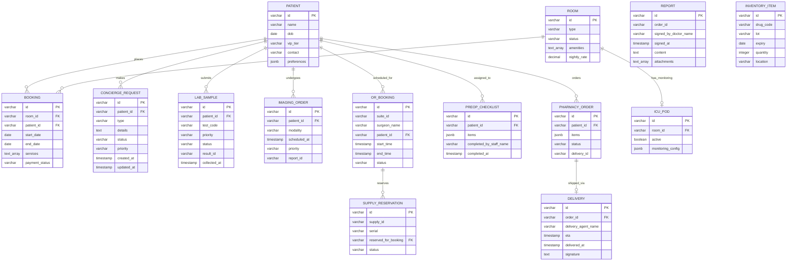

# MediCore Luxury Services - Database Schema Entity Relationship Diagram (ERD)

This document contains the schema definition and entity relationships for the five priority luxury services. The schema is client-centric, focusing on patient flows, bookings, diagnostics, and delivery processes.

## Mermaid ERD Diagram

## Description of Entities

### Core Entities
1. **PATIENT**: VIP Patient profile. Stores standard EHR identifiers, contact info, and encrypted preference parameters (`preferences` JSONB includes custom dining, pillows, newspaper, visiting constraints).

### Accommodation System
2. **ROOM**: VIP Room inventory tracking availability, style types (vip, deluxe, suite), special amenities lists, and pricing ledgers.
3. **BOOKING**: Inpatient room scheduler linking patients to reserved VIP suites and custom add-on guest services.
4. **ICU_POD**: Extension of VIP suites detailing physical monitoring states and real-time alert thresholds.

### Clinical & Operations System
5. **CONCIERGE_REQUEST**: Single-ticket tracking entity for patient-initiated service requests (e.g. food, transport, valet, translation, etc.) with real-time status and priority.
6. **LAB_SAMPLE**: Diagnostics workflow tracker for specimens marked with high VIP priority flags to expedite lab turnaround.
7. **IMAGING_ORDER**: Radiology queue scheduler holding specific modalities (MRI, CT, PET) and scheduling configurations.
8. **REPORT**: The output of diagnostic testing or radiology reviews.

### Surgical Suite
9. **OR_BOOKING**: Dedicated scheduler slots inside high-tech operating suites (like DaVinci Robotic ORs) linking booked patients and surgery schedules.
10. **SUPPLY_RESERVATION**: Serial tracking system securing specific implants or premium surgical assets for upcoming surgeries.
11. **PREOP_CHECKLIST**: Custom digital form aggregating multi-department sign-offs (Anesthesia, Lab clearance, eConsent) required for VIP operations.

### Pharmacy & Home Delivery
12. **PHARMACY_ORDER**: Pharmacy worksheet capturing prescription medications and bespoke compounding parameters.
13. **INVENTORY_ITEM**: Detailed drug lot database logging expiries, quantities, and locations.
14. **DELIVERY**: Delivery agent worksheet mapping shipping updates, routes, cold chain confirmations, and sign-offs.
